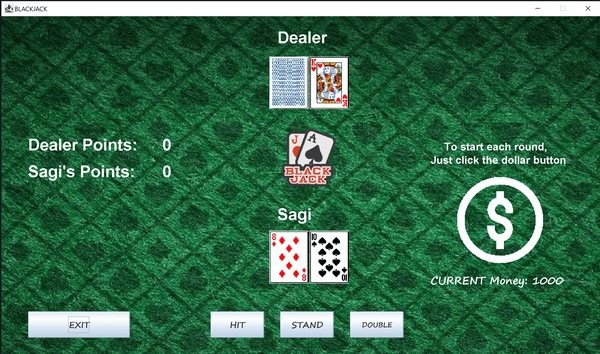

# Blackjack Game in Java

Welcome to the exciting world of Blackjack! This project implements a classic Blackjack game using Java Swing, allowing you to enjoy a casino experience directly from your computer.

## Table of Contents

* [Game Overview](#game-overview)
* [Features](#features)
* [Installation](#installation)
* [How to Play](#how-to-play)
* [About the Game](#about-the-game)
* [Screenshots](#screenshots)

## Game Overview

Blackjack, also known as 21, is a popular card game where the goal is to beat the dealer by obtaining a hand with a value closer to 21 without exceeding it. The game is played with a standard 52-card deck. The card values are: number cards (2-10) are worth their face value, face cards (J, Q, K) are worth 10 points, and an Ace can be considered as 1 or 11 points, depending on the current hand.

## Features

* User-friendly Graphical User Interface (GUI) based on Java Swing.
* Visual display of cards with simple dealing animations.
* Interactive buttons for player actions (Hit, Stand, and possibly Double Down).
* Tracking of the player's money balance.
* Option to enter the player's name.
* In-game messages and explanations.

## Installation

1. Make sure you have **Java Development Kit (JDK)** version 8 or higher installed on your system.

2. Clone the project from GitHub to your computer.

3. Open the project in an Integrated Development Environment (IDE) such as IntelliJ IDEA or Eclipse.

4. Navigate to the main game file.

5. Compile and run the Main.java file to start the game.
   
## How to Play

1. Launch the game and enter your name when prompted.

2. Click the "PLAY" button to enter the Blackjack table.

3. To start a round, click the dollar sign icon to place a bet.

4. Choose your actions: "HIT" to take another card, "STAND" to keep your hand, or "DOUBLE" to double your bet and take one more card.

5. The dealer will play their hand automatically.

6. The game will declare the winner, and your balance will be updated accordingly.

## About the Game

This Blackjack game project was created by Sagi Menahem in 2016 as a pre-army project to learn programming in Java and explore the principles of Swing GUI development. The code has been recently improved and updated.

If you have any questions or suggestions, please contact sagiia1997@gmail.com.

## Screenshots

